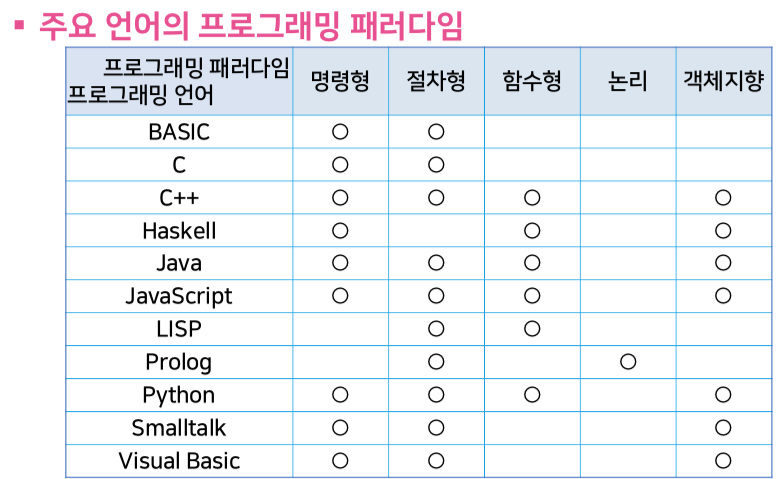

# Programming paradigm

객체지향 프로그래밍, 함수형 프로그래밍 등 용어는 많이 들어봤는데 등장한 배경은 뭘까요?   
프로그래밍 언어론 강의에서 나오는 **프로그래밍 패러다임**에 대해서 정리해봤습니다. 

### 프로그래밍 패러다임

*  프로그램을 작성하는 방식이나 스타일
* 특정 언어에 종속적인 것이 아닌 프로그래머가 추구하는 프로그램 작성 방식

### 프로그래밍 패러다임의 변화

✓ 주어진 데이터에 어떤 연산을 어떤 순서로 할지 결정하는 것이 중요   
    → 명령형 프로그래밍 패러다임 등장

✓ 복잡한 데이터 처리를 위해 데이터 처리 방식 자체를 잘 정리하는 것이 중요   
    → 절차형 프로그래밍 패러다임 등장

✓ 데이터가 저장된 메모리를 관리하는 것이 어려운 문제로 대두   
    → 함수형 프로그래밍 패러다임 등장

✓ 계산 절차를 문제의 조건을 명시하는 규칙으로 생각   
    → 논리 프로그래밍 패러다임 등장

✓ 같은 데이터에 대해 다른 처리 절차를 여러 개 명시해야 하는 경우가 흔히 발생   
    → 객체지향 프로그래밍 패러다임 등장

### 주요 언어의 프로그래밍 패러다임

✓ 다양한 프로그래밍 패러다임은 서로 양립할 수 있음

✓ 새로운 패러다임의 등장으로 이전에 있던 패러다임이 더욱 공고히 완성

✓ 주류 프로그래밍 패러다임이 바뀜에 따라 이를 언어가 수용하는 형태로 변화  

예: Python  
 명령형 패러다임, 절차형 패러다임 지원  
    → 함수형 패러다임, 객체지향 패러다임을 포함

### 명령형 프로그래밍

✓ 프로그램: 일련의 명령어 나열  
✓ 장점: 프로그램을 쉽게 이해할 수 있음  
✓ 단점: 프로그램이 복잡한 경우 효과적으로 다루지 못함  

### 절차형 프로그래밍

✓ 프로그램: 서브루틴이라는 절차의 집합  
✓ 장점: 재귀호출을 사용하여 프로시저를 간단하게 정의

### 객체지향 프로그래밍

✓ 프로그램: 서로 통신할 수 있는 객체\(object\)의 집합   
✓ GUI 개발에 큰 획\(Smalltalk\)  
✓ 프로그램 재사용 편의로 S/W 생산성에 크게 기여객체의 개념  
✓ 상태를 유지하며 외부의 요청에 반응하는 데이터   
✓ 상태 - 필드\(멤버 변수\), 반응 - 메소드\(멤버 함수\)   
✓ 상태는 외부에 숨기고 메소드는 외부에 공개

### 함수형 프로그래밍

✓ 데이터는 값으로, 명령어는 함수로 취급    
✓ 명령어가 데이터를 바꿀 수 없음   
✓ 대입문과 반복문 없음  
✓ 함수 자체도 값으로 취급 가능  

### 프로그래밍 패러다임의 특징

✓ 객체지향 패러다임  
     : 객체 사이의 통신을 통해 계산을 표현

✓ 함수형 패러다임  
    : 함수의 적용을 통해 계산을 표현

✓ 논리 패러다임  
    : 논리식의 진위를 증명하는 과정을 통해 계산을 표현  

