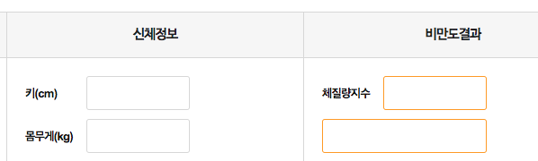

# bmi

결과참고 : [http://www.foodsafetykorea.go.kr/portal/healthyfoodlife/bmiCalcurator.do?menu\_no=3071&menu\_grp=MENU\_NEW03](http://www.foodsafetykorea.go.kr/portal/healthyfoodlife/bmiCalcurator.do?menu_no=3071&menu_grp=MENU_NEW03) 

실습 목적: 입력, 출력, 버튼이벤트, 연산, 변수 

입력: 키, 몸무게\(입력은 센티미터로 받기\)  

버튼: 계산하기, 초기화 

출력: 체질량지수, 저체중/정상체중/과체중/경도비만/중등도비만/고도비만 출력 

[https://ko.wikipedia.org/wiki/%EC%B2%B4%EC%A7%88%EB%9F%89\_%EC%A7%80%EC%88%98\#%EC%95%84%EC%8B%9C%EC%95%84](https://ko.wikipedia.org/wiki/%EC%B2%B4%EC%A7%88%EB%9F%89_%EC%A7%80%EC%88%98#%EC%95%84%EC%8B%9C%EC%95%84)

* 고도 비만 : 40 이상
* 중등도 비만 \(2단계 비만\) : 35 - 39.9
* 경도 [비만](https://ko.wikipedia.org/wiki/%EB%B9%84%EB%A7%8C) \(1단계 비만\) : 30 - 34.9
* [과체중](https://ko.wikipedia.org/wiki/%EA%B3%BC%EC%B2%B4%EC%A4%91) : 25 - 29.9
* 정상 : 18.5 - 24.9
* [저체중](https://ko.wikipedia.org/wiki/%EC%A0%80%EC%B2%B4%EC%A4%91) : 18.5 미만

