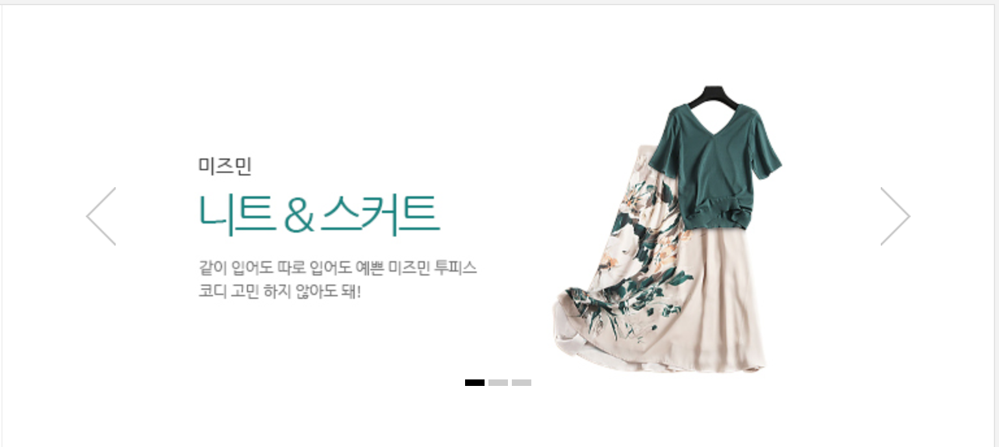

# function2

* slideImgArr에 있는 이미지를 사용하여 이미지 슬라이드 구현 \(애니메이션 제외\)
  * '이전 이미지' 을 누르면 이전 이미지의 경로를 리턴하는 함수 구현
  * '다음 이미지'을 누르면 다음 이미지의 경로를 리턴하는 함수 구현
  * currentImgIndex값 \(현재 이미지 인덱스\)를 구하는 함수 구현
  * '이전 이미지', '다음 이미지'을 누를 때마다 이미지 주소가 변경되는 함수 구현
  * 구현 하면서 필요한 함수가 있다면 구현해도 무방. 애니메이션 효과는 주지 않아도 됨.
  * 참고 : [http://shop2.daumcdn.net/shophow/sib/0\_190711174317\_WHFzDOodnDUymbRJWPTjsuHSjJUxUXYz](http://shop2.daumcdn.net/shophow/sib/0_190711174317_WHFzDOodnDUymbRJWPTjsuHSjJUxUXYz)  아래 그림 참고

    

```markup
<div id="slideContent">
    <button class="btn_g btn_prev">이전 이미지</button>
    
    <button class="btn_g btn_next">다음 이미지</button>
</div>


<script>  
(function() {
    'use strict';
    var slideImgArr = ['http://shop2.daumcdn.net/shophow/sib/0_190711174317_WHFzDOodnDUymbRJWPTjsuHSjJUxUXYz','http://shop1.daumcdn.net/shophow/sib/0_190711174309_frhsqvyDAIYxSCMUnyZtbcVHddiOpCEy','http://shop3.daumcdn.net/shophow/sib/0_190711174325_rQUPoiSCCAeMENaCCNvihWEECtGFccbI'];
    var currentImgIndex = 0;
    var slideImgEl = document.querySelector('.slide_img');
    // 이전 이미지 경로 구하는 함수

    // 다음 이미지 경로를 구하는 함수

    // 현재 이미지 index (currentImgIndex값) 구하는 함수

    // 이미지의 src값을 변경하는 함수

    // 클릭 이벤트 등록하는 함수 (addEventListener)

    function init() {
        slideImgEl.setAttribute('src',slideImgArr[currentImgIndex]);
    }
    init();
})();
</script>
```

