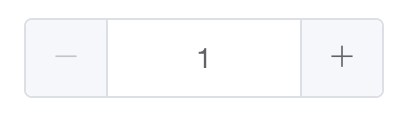

# inputNumber

결과 참고 : [https://element.eleme.io/\#/en-US/component/input-number](https://element.eleme.io/#/en-US/component/input-number) 

1단계 - 마이너스, 플러스 버튼을 누르면 input 의 숫자가 변경됩니다. 

2단계 - input에 숫자를 입력할 수 있습니다. 입력한 숫자를 기준으로 마이너스, 플러스 버튼 대응

3단계 - input에 숫자이외의 것을 입력이 안되게 합니다. 

4단계\(선택\) - min, max값 입력을 추가하여 제어할 수 있게 합니다. 

5단계\(선택\) - min, max값에 따라 마이너스, 플러스 버튼이 disabled되게 처리합니다. 

그 외 - 본인이 하고 싶은 기능을 추가 :\) 

### 참고자료 

#### BOM \(Browser Object Model\)

* 제가 예전에 정리한 것 [https://sharryhong.github.io/2016/12/28/javascript-bom/](https://sharryhong.github.io/2016/12/28/javascript-bom/)

#### DOM \(Document Object Model\)

* 제가 예전에 정리한 것 [https://sharryhong.github.io/2016/12/28/javascript-dom/](https://sharryhong.github.io/2016/12/28/javascript-dom/) 

#### Event

* click 
* keyup :  [https://developer.mozilla.org/en-US/docs/Web/Events/keyup](https://developer.mozilla.org/en-US/docs/Web/Events/keyup) 하단의 예시 참고 
* blur : [https://developer.mozilla.org/en-US/docs/Web/API/Element/blur\_event](https://developer.mozilla.org/en-US/docs/Web/API/Element/blur_event) 

#### event 객체 

* [https://blog.sonim1.com/152](https://blog.sonim1.com/152) 참고 
* event.keyCode, event.which 

#### "use strict";

#### var, let, const

#### IIFE 패턴

#### 전위 증감 연산자, 후위 증감 연산자 

#### 제이쿼리의 장점과 단점, 순수JS도 작성해보기   

