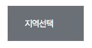
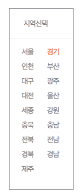

# Select

\(FT3팀 여니의 제안\) 실무에서 "디자인된 셀렉트박스"가 어떻게 개발되는지 실습해봅시다. :\) 

여니가 \*코드 공유\*해주셨습니다! 대박 완전 감사감사 ^^!!!   
=&gt; [https://github.com/sharryhong/Front-End-Team/blob/master/freeform-project/select.html](https://github.com/sharryhong/Front-End-Team/blob/master/freeform-project/select.html) 

### 결과화면 

1단계 - 마크업 주석을 참고하여 '지역선택' 버튼 클릭시 옵션이 펼쳐지게 합니다. 선택된 옵션엔 클래스 on 부여합니다. 

2단계 - `<a href="#none" class="ico_comm link_selected">지역선택선택됨</a>`  옵션선택시 위 코드에서 '지역선택' 대신 선택한 지역으로 바꿉니다. 

3단계 - 나중에 선택한 값을 백엔드 api data로 보내야합니다. 이건 나중에 하고, 우선 선택한 값을 alert으로 띄워봅니다. 

PS - 위 실습은 지역이 모두 정해져있으므 마크업에서 지역명을 모두 적어도되지만, 나중에 백엔드 api를 통해 database에 저장된 데이터를 가져와서 뿌려준 후 선택하는 경우도 많습니다. ajax통신, 백엔드 api 연동 등은 추후에 나오, 맛뵈기로 다른 예제도 하나 추가해볼게요. :\) 

